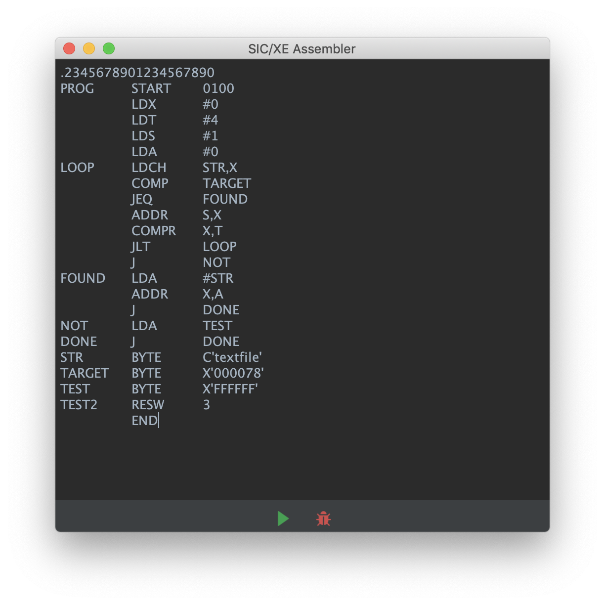
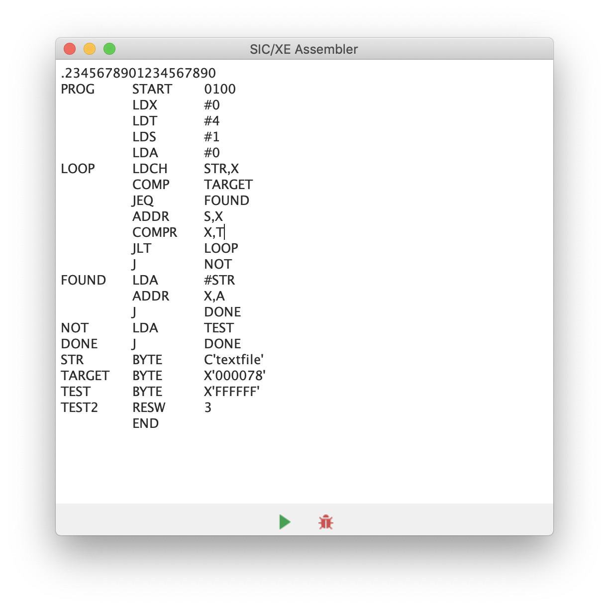

# SIC/XE Asembler
The Simplified Instructional Computer (also abbreviated SIC) is a hypothetical computer system introduced in System Software: An Introduction to Systems Programming, by Leland Beck.

## Samples
### Themes
  

## Operation Table
|Mnemonic     |Format  |Opcode  |Effect                           |Notes
|-------------|:------:|:------:|---------------------------------|:-----:
|ADD m        |  3/4   |  18    |A ← (A) + (m..m+2)               |
|ADDF m       |  3/4   |  58    |F ← (F) + (m..m+5)               |F
|ADDR r1,r2   |   2    |  90    |r2 ← (r2) + (r1)                 
|AND m        |  3/4   |  40    |A ← (A) & (m..m+2)               
|CLEAR r1     |   2    |   4    |r1 ← 0                           
|COMP m       |  3/4   |  28    |A : (m..m+2)                     |C
|COMPF m      |  3/4   |  88    |F : (m..m+5)                     |CF
|COMPR r1,r2  |   2    |  A0    |(r1) : (r2)                      |C
|DIV m        |  3/4   |  24    |A : (A) / (m..m+2)
|DIVF m       |  3/4   |  64    |F : (F) / (m..m+5)               |F
|DIVR r1,r2   |   2    |  9C    |(r2) ← (r2) / (r1)
|FIX          |   1    |  C4    |A ← (F) [convert to integer]
|FLOAT        |   1    |  C0    |F ← (A) [convert to floating]    |F
|HIO          |   1    |  F4    |Halt I/O channel number (A)      |P
|J m          |  3/4   |  3C    |PC ← m
|JEQ m        |  3/4   |  30    |PC ← m if CC set to =
|JGT m        |  3/4   |  34    |PC ← m if CC set to >
|JLT m        |  3/4   |  38    |PC ← m if CC set to <
|JSUB m       |  3/4   |  48    |L ← (PC); PC ← m<
|LDA m        |  3/4   |  00    |A ← (m..m+2)
|LDB m        |  3/4   |  68    |B ← (m..m+2)
|LDCH m       |  3/4   |  50    |A [rightmost byte] ← (m)
|LDF m        |  3/4   |  70    |F ← (m..m+5)                      |F
|LDL m        |  3/4   |  08    |L ← (m..m+2)
|LDS m        |  3/4   |  6C    |S ← (m..m+2)
|LDT m        |  3/4   |  74    |T ← (m..m+2)
|LDX m        |  3/4   |  04    |X ← (m..m+2)
|LPS m        |  3/4   |  D0    |Load processor status             |P
|MUL m        |  3/4   |  20    |A ← (A) * (m..m+2)
|MULF m       |  3/4   |  60    |F ← (F) * (m..m+5)
|MULR r1,r2   |   2    |  98    |r2 ← (r2) * (r1)
|NORM         |   1    |  C8    |F ← (F) [normalized]              |F
|OR m         |  3/4   |  44    |A ← (A)  (m..m+2)
|RD m         |  3/4   |  D8    |A [rightmost byte] ← data         |P
|RMO r1,r2    |   2    |  AC    |r2 ← (r1)
|RSUB         |  3/4   |  4C    |PC ← (L)
|SHIFTL r1,n  |   2    |  A4    |r1 ← (r1); left circular shift
|SHIFTR r1,n  |   2    |  A8    |r1 ← (r1); right shift n bits
|SIO          |   1    |  F0    |Start I/O channel number (A)      |P
|SSK m        |  3/4   |  EC    |Protection key for address m      |P
|STA m        |  3/4   |  0C    |m..m+2 ← (A)
|STB m        |  3/4   |  78    |m..m+2 ← (B)
|STCH m       |  3/4   |  54    |m ← (A) [rightmost byte]
|STF m        |  3/4   |  80    |m..m+5 ← (F)                       |F
|STI m        |  3/4   |  D4    |Interval timer value ← (m..m+2)    |P
|STL m        |  3/4   |  14    |m..m+2 ← (L)
|STS m        |  3/4   |  7C    |m..m+2 ← (S)
|STSW m       |  3/4   |  E8    |m..m+2 ← (SW)                      |P
|STT m        |  3/4   |  84    |m..m+2 ← (T)
|STX m        |  3/4   |  10    |m..m+2 ← (X)
|SUB m        |  3/4   |  1C    |A ← (A) - (m..m+2)
|SUBF m       |  3/4   |  5C    |F ← (F) - (m..m+5)                 |F
|SUBR r1,r2   |   2    |  94    |r2 ← (r2) - (r1)
|SVC n        |   2    |  B0    |Generate SVC interrupt
|TD m         |  3/4   |  E0    |Test device specified by (m)       |PC
|TIO          |   1    |  F8    |Test I/O channel number (A)        |PC
|TIX m        |  3/4   |  2C    |X ← (X) + 1; (X) : (m..m+2)        |C
|TIXR r1      |   2    |  B8    |X ← (X) + 1; (X) : (r1)            |C
|WD m         |  3/4   |  DC    |Device specified by (m) ← (A)      |P

